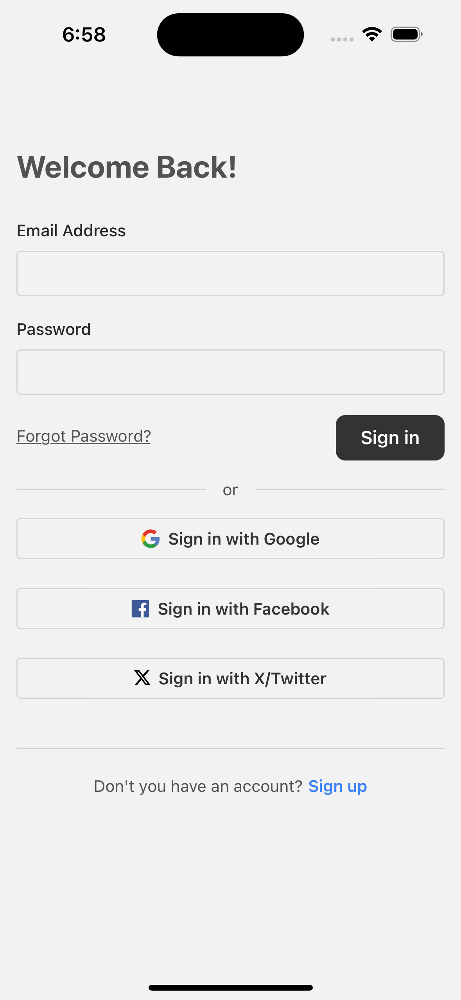

# MG Expo Boilerplate

this is a modular boilerplate for building mobile applications using [Expo](https://expo.dev/). This boilerplate is designed to provide a solid foundation for your projects, with essential tools and configurations for modern app development.

## PREVIEW



## Features

- **Expo Managed Workflow**: Quick setup and easy development.
- **TypeScript Support**: Fully typed codebase for enhanced productivity and reliability.
- **Folder Structure**: Pre-configured directory layout for scalability.
- **State Management**: Integrated with [Zustand](https://github.com/pmndrs/zustand).
- **Routing**: Ready-to-use navigation with [React Navigation](https://reactnavigation.org/).
- **API Integration**: Apollo GraphQL or RESTful API support.
- **Linting & Formatting**: Configured with ESLint and Prettier.
- **Testing**: Pre-configured with [Jest](https://jestjs.io/) for unit and integration tests.

---

## Getting Started

### Prerequisites

- [Node.js](https://nodejs.org/) (LTS version recommended)
- [Expo CLI](https://docs.expo.dev/get-started/installation/)

### Installation

1. Clone this repository:

   ```bash
   git clone https://github.com/ayopela3/expo-boilerplate.git
   cd expo-boilerplate
   ```

2. Install dependencies:

   ```bash
   npm install
   ```

3. Create a `.env` file at the root of the project and define your environment variables:

   ```env
   API_URL=https://your-api-url.com
   AUTH_SECRET=your-secret-key
   ```

4. Start the development server:
   ```bash
   npm run start
   ```

---

## Folder Structure

```
expo-boilerplate/
├── src/
│   ├── api/           # API configurations and services
│   ├── assets/        # Static assets (images, fonts, etc.)
│   ├── components/    # Reusable components
│   ├── navigation/    # App navigation
│   ├── screens/       # Application screens
│   ├── store/         # Zustand state management
│   └── utils/         # Utility functions and
├── App.tsx            # Entry point
├── .env               # Environment variables
├── .eslintrc.js       # ESLint configuration
├── .prettierrc        # Prettier configuration
├── app.json           # Expo configuration
├── babel.config.js    # Babel configuration
├── jest.config.js     # Jest configuration
├── tailwind.config.js # Tailwind configuration
├── tsconfig.json      # Typescript configuration
├── package.json       # Dependencies and scripts
└── README.md          # Project documentation
```

---

## Scripts

- `yarn start`: Start the development server.
- `yarn android`: Run the app on an Android emulator or device.
- `yarn ios`: Run the app on an iOS simulator or device.
- `yarn lint`: Run ESLint for code analysis.
- `yarn test`: Run unit and integration tests.

---

## Customization

- **Adding Components**: You can easily integrate the necessary modifiable component by just using this command below.

  for example you would want to add a box component:

  ```bash
   npx gluestack-ui add box
  ```

  to know more: https://gluestack.io/ui/docs/components/all-components

- **State Management**: Modify the `store/` directory to add or remove state slices.

- **API**: Update `api/` to integrate your own APIs.

---

## Contribution

Contributions are welcome! Feel free to open issues or submit pull requests for improvements and bug fixes.

---

## License

This project is licensed under the [MIT License](./LICENSE).
